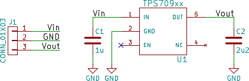
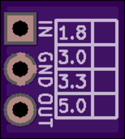
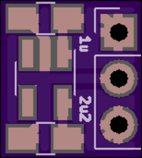
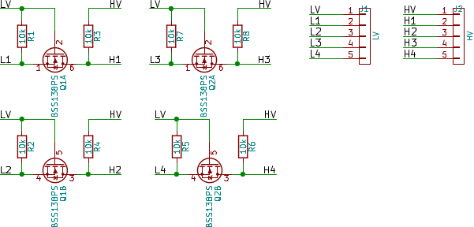
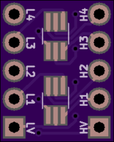
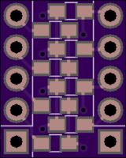

# breadboard-adapters

Various small schematics + PCBs for prototyping on breadboards

## TPS709xx breadboard adapter

TPS709xx breadboard adapter based on the reference design of the [TI datasheet](
http://www.ti.com/lit/ds/symlink/tps709.pdf).

2 layer board of 0.31x0.34 inches (7.77x8.66 mm). 

<a href="https://oshpark.com/shared_projects/ZPfzHzE1"></img></a>

Details: [TI datasheet](http://www.ti.com/lit/ds/symlink/tps709.pdf)

BOM:
- 1x TPS709xx voltage regulator
- 1x 3x1 pin headers
- 1x 1u 25V X7R capacitor, 0805
- 1x 2u2 10V X7R capacitor, 0805

## Breadboard level shifter

4x breadboard level shifter similar to [Sparkfun #12009](https://www.sparkfun.com/products/12009) and [Adafruit #757](https://www.adafruit.com/products/757).

2 layer board of 0.40x0.50 inches (10.21x12.75 mm)

<a href="https://oshpark.com/shared_projects/CuXsJ7my"></img></a>

Details: [NXP app note AN10441](http://www.nxp.com/documents/application_note/AN10441.pdf)

BOM:
- 2x BSS138PS, SOT-363
- 2x 5x1 pin headers
- 8x 10k resistors, 0603
